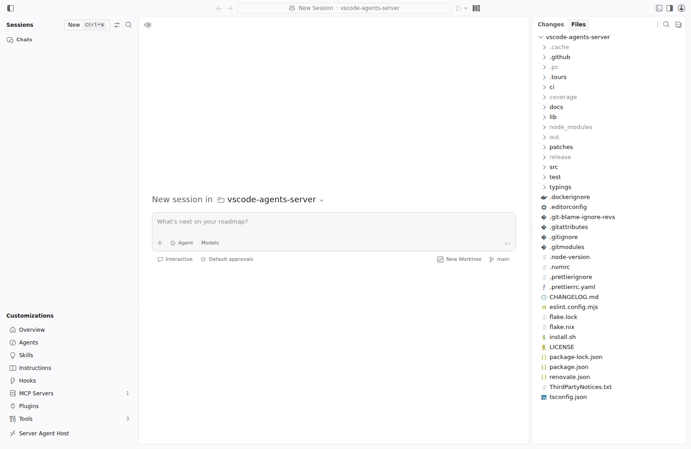

# vscode-agents-server

`vscode-agents-server` is a self-hosted, browser-based home for VS Code Agent
sessions. It is built from [code-server](https://github.com/coder/code-server)
and the VS Code Sessions experience, with the editor surface removed so the
server can focus entirely on creating, monitoring, and resuming coding agents.



## Highlights

- Dedicated Agents UI at the server root; editor routes are not exposed
- Server-side Agent Host with persistent sessions and workspace access
- BYOK-only model access through an explicit JSON provider catalogue
- OpenAI-compatible, Anthropic, and native DeepSeek model transports
- Workspaces are trusted automatically so unattended agents are never blocked
  by a confirmation dialog
- Reverse-proxy and sub-path deployments are supported

## Requirements

- Linux
- Node.js 24 when building or installing through npm
- WebSocket support between the browser and server
- At least 1 GB RAM and 2 CPU cores; agent workloads may need more

## Build from source

```bash
git submodule update --init
quilt push -a
npm ci
npm run build
VERSION=0.0.0 npm run build:vscode
KEEP_MODULES=1 npm run release
```

The standalone executable is generated at
`release/bin/vscode-agents-server`.

## Configure BYOK

A BYOK catalogue is required. It describes the providers and models available
to Agents while referring to API keys by environment-variable name. For
example:

```json
{
  "version": 1,
  "providers": [
    {
      "id": "anthropic",
      "type": "anthropic",
      "baseUrl": "https://api.anthropic.com",
      "apiKeyEnv": "ANTHROPIC_API_KEY",
      "models": [
        {
          "id": "claude-sonnet",
          "name": "Claude Sonnet",
          "maxContextWindowTokens": 200000
        }
      ]
    }
  ]
}
```

Export the referenced key and pass the catalogue path when starting the server:

```bash
export ANTHROPIC_API_KEY="..."
./release/bin/vscode-agents-server \
  --agents-byok-config /etc/vscode-agents-server/byok.json \
  --bind-addr 0.0.0.0:3000 \
  /path/to/workspace
```

The server refuses to start without `--agents-byok-config`. Keys are captured
at startup, removed from the generic child-process environment, and delivered
only to the server-side Agent Host. See [Web Agents and server-side
BYOK](./agents.md) for the full schema, DeepSeek configuration, security model,
and reverse-proxy behavior.

## License and upstream

This project retains the upstream [MIT license](../LICENSE). Its server and
packaging foundation comes from [coder/code-server](https://github.com/coder/code-server),
while the Agents experience is based on Visual Studio Code.
